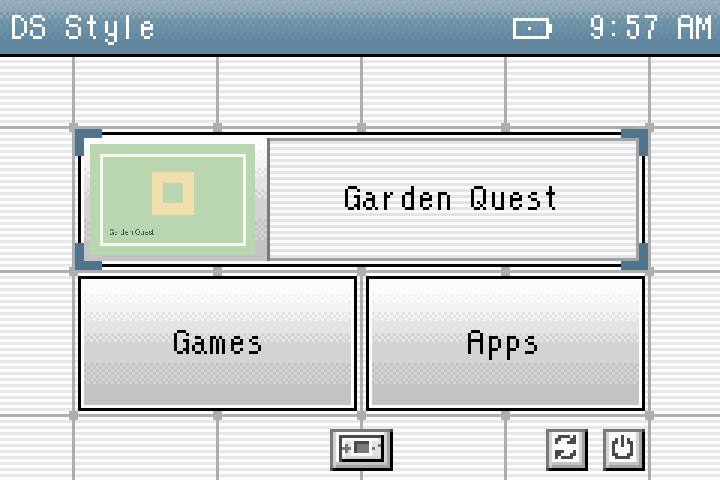
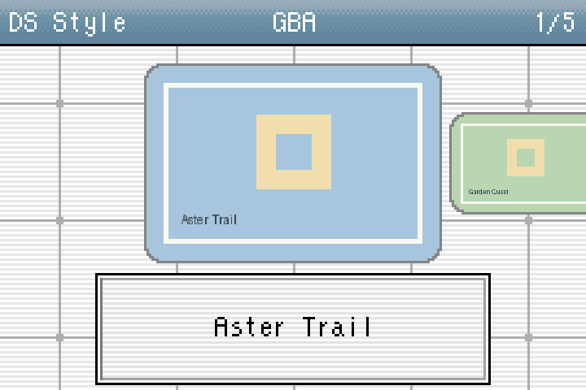

# DS Style for RG SP

**What if your GBA could play all these consoles?**

DS Style is a fun, Nintendo DS-inspired launcher that brings the feel of original hardware and a flashcart to the Anbernic RG SP. Originally created for the GBA's EZ-FLASH Omega and Omega Definitive Edition, its familiar menus, sounds and customisable appearance now sit over the RG SP's stock operating system.

Instead of making your RG SP a GBA-only handheld, DS Style imagines a GBA with access to the RG SP's wider library. It uses your installed stock emulators, core choices, settings and saves, with features that make browsing a larger collection comfortable.

**For the new RG SP running stock OS. Not for RG35XXSP.** This is a launcher, not firmware. No games, BIOS files, emulator cores or replacement RetroArch installation are included.

Screenshots show the actual frontend with fictional game names and sample artwork.

## Download and install

1. Download **DS-Style-RG-SP-v1.0.zip** from [Releases](https://github.com/FrankieT19/rg-sp-ds-style/releases/latest).
2. Shut down the handheld and connect your ROM card to your computer.
3. Extract the ZIP. Copy its **Roms** folder to the card's root, merging with your existing Roms folder.
4. Safely eject the card, put it back in the RG SP and boot stock OS.
5. Open **Apps → DS Style**.

Install on either SD1 or SD2; one copy is enough. Games and apps on both cards are available. Start with manual launch; when you are happy with it, enable **Settings → Startup → Autoboot** if desired. Autoboot needs SD1 present even when DS Style is installed on SD2. If prompted, select stock's old/classic menu style before enabling it.

## Features

- DS Style's familiar Home screen, animated selection corners, sounds and bitmap font.
- List, List + Art, horizontal and vertical views, with separate folder browsing preferences.
- Colour themes, dark mode, artwork positioning, adaptive borders and optional rounded corners.
- Stock game thumbnails, editable system artwork and an optional **GBA res. art** effect.
- Optional LCD grid and Pixel Transparency filters, usable together.
- Folder search and a search across systems; press **X** while browsing.
- Shared stock favourites and recent history, plus a configurable Home quick-launch game.
- Stock RetroArch and Game Rooms launch routes; change a system's route with **START** on the Systems list. Core selections are read from stock when launching.
- Both ROM cards, full system names, system icons and an optional Apps entry in Systems.
- Startup destinations, an optional quick-start hotkey, and a Home button that can open Apps, favourites or recents.
- Rebindable action controls, external-controller support, contextual settings help and eight language choices: English (UK/US), French, German, Spanish, Portuguese, Italian and Dutch.
- Stock brightness, volume, sleep and wake integration, with access to **Stock OS** for more advanced settings.
- A secret Snake game tucked away in About.

External-controller hotplug and HDMI output are implemented but have not had the same on-device testing as the built-in controls. Stock integration has been developed against the tested RG SP stock/mod layouts; other firmware revisions may differ. Unsupported launch layouts report an error instead of guessing a core.

## Controls

| Button | Default action |
| --- | --- |
| D-pad | Move selection; left/right page through lists or cycle the Home game when selected |
| A / B | Open or confirm / return or cancel |
| Y | Add/remove favourite; open favourites from Home |
| X | Search while browsing; explain the selected setting |
| SELECT | Change view; switch Home between recents and favourites |
| L / R | Switch tabs; cycle the Home game from any Home selection |
| L2 / R2 | Open recents / favourites |
| START | Set a system's launch route on the Systems list |
| MENU | Settings |
| Volume − / + | Volume; hold to repeat |
| MENU + Volume − / + | Brightness; hold to repeat |

The built-in Help page follows your control bindings. D-pad navigation stays fixed, conflicting bindings swap and a reset-to-defaults option is available. Hold the **physical START button during boot** to bypass automatic last-game/quick-start launching and reach DS Style.

## Customise

Inside `Roms/APPS/DSStyle`:

- **Folder Art/**: add `GBA.png`, `Game Boy Advance.jpg`, `PS.png`, etc. Matching is case-insensitive; PNG, JPEG and BMP are supported. Game artwork continues to use stock's `Imgs` folders.
- **assets/**: editable backgrounds, themes, sounds and icons. Keep the original image dimensions; list icons use a 16 × 14 canvas with transparent spacing. WAV files must be 48 kHz, stereo, 16-bit PCM.
- **username.txt**: change the name shown in the title bar.
- **state/**: created on first use for preferences and local bookkeeping. Keep it when updating.

The `bin`, `scripts` and `config` folders are required components. `licenses` contains attribution notices. [First-launch defaults](docs/DEFAULTS.md) only apply to a fresh installation; updates retain saved preferences.

## Update or uninstall

**Update:** back up your existing DS Style folder. Merge the new package, keeping `state`, your configuration, Folder Art, username and any assets you edited. If an update changes an asset you customised, compare it with your backup rather than losing your edits.

**Uninstall:** first switch **Startup → Autoboot → Off**. Then use **System → Stock OS**, shut down safely and remove `Roms/APPS/DS Style.sh` and `Roms/APPS/DSStyle` from the card. Turning Autoboot off restores the previous boot override. Your ROMs, emulators and saves stay in their stock locations.

If an autoboot installation cannot open, create an empty file named **DISABLED** (no extension) inside `Roms/APPS/DSStyle` on the card. The next boot skips DS Style. Keep the installation present, launch it manually from stock Apps and disable Autoboot before removing it. [More on stock integration and recovery](docs/STOCK-INTEGRATION.md).

## Source, credits and contributing

This repository includes the source and editable assets. See [building and testing](docs/BUILDING.md) and [contributing](CONTRIBUTING.md).

DS Style is by **FrankieT19**. Its GBA roots are the [Omega](https://github.com/FrankieT19/omega-ds-style-kernel) and [Omega Definitive Edition](https://github.com/FrankieT19/omega-de-ds-style-kernel) projects, building on EZ-FLASH and Sterophonick's SimpleLight. Filter acknowledgements include Gigaherz and jdgleaver (lcd1x inspiration), and Matt Akins (Pixel Transparency). Full artwork, library and runtime credits are in [CREDITS.md](CREDITS.md) and the bundled notices.

Project code is [Apache-2.0](LICENSE); third-party components and artwork retain their own licences. DS Style is an independent project, with no affiliation with or endorsement by Nintendo, Anbernic, EZ-FLASH, RetroArch or NextUI.
